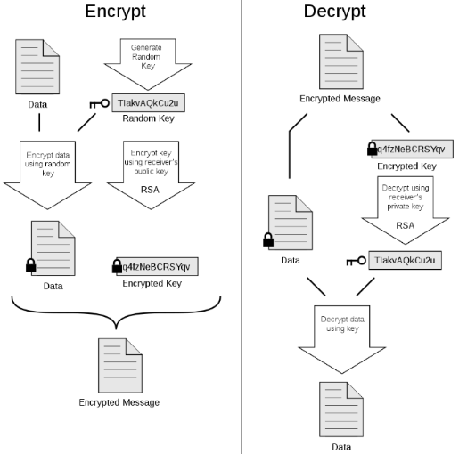

---
{
  "title": "crypto",
  "tags": [ "crypto", "ras", "hmac", "ed25519", "GPG", "rsa.OAEP" ],
  "layout": "blog/blog.base.gohtml",
  "cTime": "2024-08-11 14:33",
  "mTime": "2024-08-19"
}
---

# crypto

主要需要提供功能:

- 加簽: 需要確保加簽者唯一，也就是不能有多種方法其加簽出來的結果都指向某位使用者，這樣驗證就沒有意義了

  > 為了要能將加簽的物件，生成出一個唯一的識別碼，常用了話會使用SHA256, 512, ...的方式來生成

- 驗證:
  - 物件,key都相同，能驗證出加簽的對象
  - 物件相同但key不正確驗證需失敗

## HMAC (Keyed-Hash Message Authentication Code)

對稱式加密: 加簽與驗證都用同樣的密鑰

```go
key := []byte("...private_key...")
hasher := hmac.New(
		crypto.SHA256.New, // 雜湊值算法
		key,
)
// Sign
const signingString = "hello" // 假設這個是被加簽的內容
hasher.Write([]byte(signingString))
mac1 = hasher.Sum(nil)

// Verify
hasher2 := hmac.New(
  crypto.SHA256.New, // 生成出物件的指紋
  key, // 如果密鑰不同，則驗證要失敗
) // 要想辦法得知加簽時所用的內容和密鑰
hasher.Write([]byte(signingString))
mac2 = hasher.Sum(nil)

if hmac.Equal(mac1, mac2) {
    // Valid
}
```

## RSA

之所以可行主要是因為: `大整數因式分解的困難性`

RSA是由羅納德·李維斯特（`R`on Rivest）、阿迪·薩莫爾（Adi `S`hamir）和倫納德·阿德曼（Leonard `A`dleman）在1977年一起提出的。

非對稱式加密: 加簽用私鑰; 驗證用公鑰

```go
// 生成私鑰
var rsaKey *rsa.PrivateKey
rsaKey, _ = rsa.GenerateKey(rand.Reader, 2048) // 2048, 3072, 4096

// Privacy-Enhanced Mail (PEM)
// 保存私鑰
_ = pem.Encode(writer, &pem.Block{
      Type:    "RSA PRIVATE KEY",
      Headers: map[string]string{},
      Bytes:   x509.MarshalPKCS1PrivateKey(rsaKey),
})

// 保存公鑰
_ = pem.Encode(writer2, &pem.Block{
			Type:    "RSA PUBLIC KEY",
			Headers: map[string]string{},
			Bytes:   x509.MarshalPKCS1PublicKey(&rsaKey.PublicKey),
})

// Sign
// 將我們要簽署的內容計算其SHA256, 生成出此物件的指紋
hash := crypto.SHA256
hasher := hash.New()
hasher.Write([]byte(signingString))
fingerprint := hasher.Sum(nil)
signedBytes, _ = rsa.SignPKCS1v15( // PKCS#1 是RSA實驗室提出的一系列標準, v1.5是其中的一個版本
  rand.Reader,
  rsaKey,
  hash,
  fingerprint
)

// Verify
var rsaPublicKey *rsa.PublicKey // 要想辦法得知公鑰，通常SERVER會告知您公鑰可以上拿取得
hash := crypto.SHA256 // 這邊一樣要想辦法得知加簽時所用的指紋演算法
hasher = hash.New()
hasher.Write([]byte(signingString))
singingBytes := hasher.Sum(nil)
if err := rsa.VerifyPKCS1v15(
  // 有以下四項即可進行驗證
  // {公鑰 + 指紋的演算法(sha) + 本次物件(如果沒辦串改就和以前加簽的物件相同) + 之前透過私鑰加簽出來的結果}
  rsaPublicKey, // em, err := rsa.encrypt(pub, signedBytes)
  hash, // hashLen, prefix, err := pkcs1v15HashInfo(hash, len(singingBytes)); tLen := len(prefix) + hashLen; k := pub.Size(); if k < tLen+11 { return ErrVerification } // hash搭配singingBytes可以得到某種長度，此長度要與公鑰匹配
  singingBytes, // 要與em的某一段匹配: https://github.com/golang/go/blob/a10e42f219abb9c5bc4e7d86d9464700a42c7d57/src/crypto/rsa/pkcs1v15.go#L362
  signedBytes, // em, err := rsa.encrypt(pub, signedBytes)有一段會驗證: https://github.com/golang/go/blob/a10e42f219abb9c5bc4e7d86d9464700a42c7d57/src/crypto/rsa/pkcs1v15.go#L362
); err == nil {
  // Valid
}
```

rsa.SignPKCS1v15其實裡面還有做一些填充的方法，來將資料轉換成適合的長度和格式。例如:

- 格式: 固定前面多少byte是xxx
- 長度: 填充多少垃圾來達到滿長度

[playground](https://go.dev/play/p/W1vH5B7eL5z)

### RSA.OAEP (Optimal Asymmetric Encryption Padding)

這個演算法可以將對方的公鑰把訊息加密，解密的時候只有其私鑰才能解

此算法在GPG(GNU Privacy Guard)很有用

```
privateKey, _ := rsa.GenerateKey(rand.Reader, 2048)
publicKey := &privateKey.PublicKey
message := []byte("my data")
iHasher := sha256.New()
encryptedData, _ := rsa.EncryptOAEP(iHasher, rand.Reader, publicKey, message, nil)
message2, _ := rsa.DecryptOAEP(iHasher, rand.Reader, privateKey, encryptedData, nil)
```
[go-playground](https://go.dev/play/p/KZjcf90h8N5)

## [GPG(GNU Privacy Guard)](https://gist.github.com/CarsonSlovoka/1876a3ae7cd821a201d39aa96beccffe)



```
Encrypt(
  data []byte,
  publicKey *rsa.PublicKey,
  symmetricKey[]byte
) (
  []byte // 輸出資料 symmetricAlg(data, symmetricKey) + rsa.EncryptOAEP(publicKey, symmetricKey)
)
```
餵入一個隨機生成出來的隨機數，以及公鑰內容。

Encrypt使用此隨機數當成對稱式加密的密鑰，對原始內容進行加密

為了能讓對方也能得知此隨機數，將此亂數用[rsa.OAEP](https://en.wikipedia.org/wiki/Optimal_asymmetric_encryption_padding)進行加密: 它會使用到對方提供的公鑰

由於加密出來的產物，如果要解開，只能用此公鑰對應的私鑰才能解，因此理論上只有私鑰擁有者才能解

---

```
Encrypt(
  data []byte,
  privateKey *rsa.PrivateKey,
) []byte
```

解密過程，解密的格式一般是公開的，因此可以很容易的從data分離出加密過的數據{encryptedData, encryptedSymmetricKey}

由於encryptedSymmetricKey，只要擁有其對應的私鑰，就能解除

解完之後可得symmetricKey，由於encryptedData的內容是使用此key用對稱式密鑰去加簽，因此在已得到還原的key時，就能解密，所以可得原始內容

### 討論

- 會話密鑰的複雜性：GPG生成的會話密鑰通常是非常長且隨機的。這使得暴力破解在計算上變得不可行
- 公鑰加密: 會話密鑰本身是用接收者的公鑰加密的。除非你能破解RSA或其他公鑰加密算法(這在計算上是極其困難的),否則你無法獲得會話密鑰
- 對稱加密算法的強度：GPG使用的對稱加密算法(如AES)被設計為即使攻擊者知道所使用的算法,也無法在沒有密鑰的情況下破解
- 密鑰管理：GPG的安全性很大程度上取決於用戶如何保護他們的私鑰。如果私鑰被妥善保管,即使攻擊者截獲了加密的通信,也無法解密
- 前向保密：每次通信都使用新的會話密鑰,這意味著即使一個會話被破解,也不會危及其他會話的安全

如果你的過程分成很多通信且你的資料只有在所有內容都有時才有意義，那麼要破解就代表他必須掌握每一段通信，且每一段通信的會話密鑰要被破解，之後才能組裝起來，因此困難度相當大

### 範例

<script src="https://gist.github.com/CarsonSlovoka/1876a3ae7cd821a201d39aa96beccffe.js"></script>

## Ed25519與RSA的比較

### 算法基礎

- Ed25519: 基於橢圓曲線密碼學 (ECC)，具體來說，使用的是 Curve25519 曲線
- RSA: 基於大整數因式分解的困難性

### 密鑰長度

- Ed25519: 固定密鑰長度，私鑰和公鑰分別為 32 字節和 32 字節
- RSA: 密鑰長度可變，一般為 2048 位或更高。公鑰和私鑰的大小隨著密鑰長度增加

### 性能

- Ed25519: 計算更快，尤其是在生成密鑰和簽名驗證時
- RSA: 比 Ed25519 慢，但由於其較長的歷史，依然被廣泛使用

### 安全性

Ed25519: 提供高安全性，對於大多數現代應用來說，Ed25519 的安全性足夠
RSA: 安全性隨著密鑰長度的增加而增強，2048 位被認為足夠安全，但隨著計算能力的提升，未來可能需要更長的密鑰

### 應用場景

- Ed25519: 常用於現代應用程序，如 SSH、GPG，以及基於加密的應用
- RSA: 廣泛用於 SSL/TLS 協議、數位證書、VPN 等
