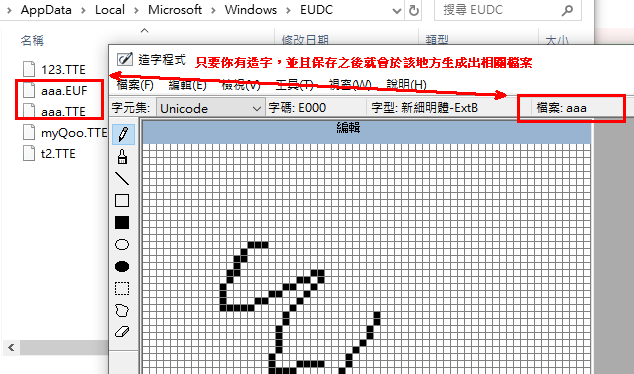

---
{
  "title": "eudcEdit",
  "tags": [ "unicode", "font", "private" ],
  "layout": "blog/blog.base.gohtml",
  "cTime": "2024-06-28T00:00:00+08:00",
  "mTime": "2023-06-28T00:00:00+08:00"
}
---

# eudcedit.exe

<kbd>win+R</kbd>打上`eudcedit.exe`可開啟，`造字程式` 介面

選擇

```
檔案 > 字型連結 > (選取你要連結所有字型或者某字型就好) > 之後按下確定，打上你要的名稱
```

完成之後，右上角會出現你現在是使用哪一個檔案



如果你沒有造字，那麼不會生成任何的檔案，直到你造完字，並且保存之後才會看到生成的檔案

> 預設保存位置: %userprofile%\AppData\Local\Microsoft\Windows\EUDC

> 副檔名是 `.TTE` 和 `EUF` 的文件，其中`TTE`其實就是opentype的格式，可以完全用opentype的方式去解析它

## 常用熱鍵

| hotkey | desc |
| ---- | ---- |
Ctrl+O | 打開碼表 ( 碼表用滾輪會失效，拖動要用滑鼠去移)
Ctrl+P | 前一個字
Ctrl+N | 下一個字
