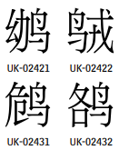
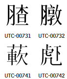

---
{
  "title": "unicode",
  "tags": [ "unicode", "font" ],
  "layout": "blog/blog.base.gohtml",
  "cTime": "2024-07-02T00:00:00+08:00",
  "mTime": "2023-07-05T00:00:00+08:00"
}
---

# Unicode

- https://www.unicode.org/Public/
- [給文字找unicode碼位](https://apps.timwhitlock.info/unicode/inspect?s=%F0%9F%93%9D)

針對不同的語言特性(例如CJK會有部首)，能找到相對應的db整理資料

## 碼表 blocks.txt

```yaml
0000..007F; Basic Latin
2E80..2EFF; CJK Radicals Supplement
4E00..9FFF; CJK Unified Ideographs
...
E000..F8FF; Private Use Area # 使用者造字區: 6400個字, eudcEdit造的就是這個區域
...
```

如果要查找最新的碼表對應[blocks.txt](https://www.unicode.org/Public/UCD/latest/ucd/Blocks.txt)

請選擇外層的UCD，而非點選某一個版本去找(最新的有可能是[draft](https://www.unicode.org/Public/draft/UCD/))


## [ArabicShaping.txt](https://www.unicode.org/Public/15.1.0/ucd/ArabicShaping.txt)

阿拉伯語、敘利亞語、蒙古語...有關

例如某個字上面有多少個點, 怎麼連接(左到右還是上到下)

## [CJKRadicals.txt](https://www.unicode.org/Public/15.1.0/ucd/CJKRadicals.txt)

你可以得到
`2E80..2EFF; CJK Radicals Supplement` 與 `4E00..9FFF; CJK Unified Ideographs` 的一些相關關係

```yaml
1; 2F00; 4E00 # ⼀; 一
2; 2F01; 4E28 # ⼁; 丨
...
214; 2FD5; 9FA0 # ⿕; 龠
```

## [CompositionExclusions.txt](https://www.unicode.org/Public/15.1.0/ucd/CompositionExclusions.txt)

(1) Script Specifics
- https://www.compart.com/en/unicode/U+0958
- ...

(2) Post Composition Version precomposed characters
- https://www.compart.com/en/unicode/U+1D15E

(3) Singleton Decompositions
- https://www.compart.com/en/unicode/U+1F71

(4) Non-Starter Decompositions
- https://www.compart.com/en/unicode/U+0344
- https://www.compart.com/en/unicode/U+0F73
- https://www.compart.com/en/unicode/U+0F75
- https://www.compart.com/en/unicode/U+0F81

## [EmojiSources.txt](https://www.unicode.org/Public/15.1.0/ucd/EmojiSources.txt)

表情符號相關

Fields: 第0欄位是指unicode的碼點，其他的欄則是不同內容所對應的碼點
- 0: Unicode code point or sequence
- 1: DoCoMo Shift-JIS code
- 2: KDDI Shift-JIS code
- 3: SoftBank Shift-JIS code

```yaml
2668;F99C;F695;F763 # ♨;...後面則是不同邊碼的碼點
1F429;;F6B8; # 🐩 https://www.compart.com/en/unicode/U+1F429
```

## EquivalentUnifiedIdeograph.txt

[go-playground](https://go.dev/play/p/xt1AUOKNVs0)


## [USourceGlyphs.pdf](https://www.unicode.org/Public/UCD/latest/ucd/USourceGlyphs.pdf)

UTC與UK碼表





## ★ [USourceData.txt](https://www.unicode.org/Public/UCD/latest/ucd/USourceData.txt)

非常有用，可以得到，但並非所有的內容都會在這邊，主要是: `U-source identifier`: 也就是列出 `UTC-00001`, `UTC-03336`

- (欄位0) UTC碼: U-source identifier
- (1) 狀態: Status
  - Comp: Encoded as a CJK Compatibility Ideograph
  - ExtA: Encoded in Extension A (例如ExtA就表示後面的這段意思)
  - ExtB: Encoded in Extension B
  - ...
  - FutureWS: A candidate for inclusion in a future IRG working set
  - NoAction: No action taken
  - ...
- (2) Unicode碼點
- (3) kRSUnicode property value (see UAX #38): 例如: `30.5`
- (4) Virtual KangXi dictionary position
- (5) Ideographic Description Sequence (IDS): [表意文字序列](https://en.wikipedia.org/wiki/Ideographic_Description_Characters_(Unicode_block))
  - `⿰⿱⿲⿳⿴⿵⿶⿷⿸⿹⿺⿻	〾`
- (6) [Source](https://www.compart.com/en/unicode/U+2ba66)

    ```yaml
    𫩦 (U+2BA66)

    Unihan Dictionary Indices
    kCheungBauerIndex	351.08
    kCowles	2908
    kMeyerWempe	2092

    # 資料就會記錄:
    # kCowles 2908*kMeyerWempe 2092*kCheungBauerIndex 351.08 # 分隔符號*
    ```
- (7) General comments
- (8) kTotalStrokes property value (see UAX #38): 該unicode形的筆畫數
- (9) First residual stroke: 部首筆畫數
