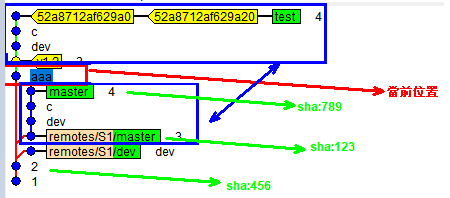

---
{
  "title": "git",
  "tags": [ "git"],
  "layout": "blog/blog.base.gohtml",
  "cTime": "2024-07-02T00:00:00+08:00",
  "mTime": "2023-07-05T00:00:00+08:00"
}
---

# git

## autocrlf

建議用`input`，搭配`safecrlf = true` 這樣就會讓文件必須要以lf結尾，否則會無法commit成功

```
╔═══════════════╦══════════════╦══════════════╦══════════════╗
║ core.autocrlf ║     false    ║     input    ║     true     ║
╠═══════════════╬══════════════╬══════════════╬══════════════╣
║               ║ LF   => LF   ║ LF   => LF   ║ LF   => CRLF ║
║ git checkout  ║ CR   => CR   ║ CR   => CR   ║ CR   => CR   ║
║               ║ CRLF => CRLF ║ CRLF => CRLF ║ CRLF => CRLF ║
╠═══════════════╬══════════════╬══════════════╬══════════════╣
║               ║ LF   => LF   ║ LF   => LF   ║ LF   => LF   ║
║ git commit    ║ CR   => CR   ║ CR   => CR   ║ CR   => CR   ║
║               ║ CRLF => CRLF ║ CRLF => LF   ║ CRLF => LF   ║
╚═══════════════╩══════════════╩══════════════╩══════════════╝
```

如果有些特殊的檔案，像是`bat`，可以透過`.gitattribute`來指定結尾，例如

```yaml
*.go text eol=lf
*.bat text eol=crlf
*.exe binary
```

## cherry-pick

如果有需要將某個分支的節點搬移到另一個分支去，可以用git cherry-pick來挑選

如果要[某一個區間](https://stackoverflow.com/q/1994463/9935654)的內容都遷移過去可以使用

```yaml
git cherry-pick (start..end]  # 注意，開頭的項目是沒有包含進去的，結尾的項目有包含

# 例如:
git cherry-pick 5fb80a1f..879842c70c
```

### 練習




假設你想要在aaa的位置，將下方藍色區塊，也就是sha:123到sha789的內容搬移到aaa的上方

那麼可以使用指令

```yaml
git cherry-pick 456..789 # 要選的是456，因為123是不包含的，你需要找123的前一個點，如果123的先前有多個岔路，會依據終點789，就能知道岔路是哪一條
```

### gitk

你可以使用`gitk --all`得到完整的圖表

也可以專注於某一個{tag, branch, sha1}

```yaml
gitk <branch>
gitk <tag>
gitk <sha1>
```
