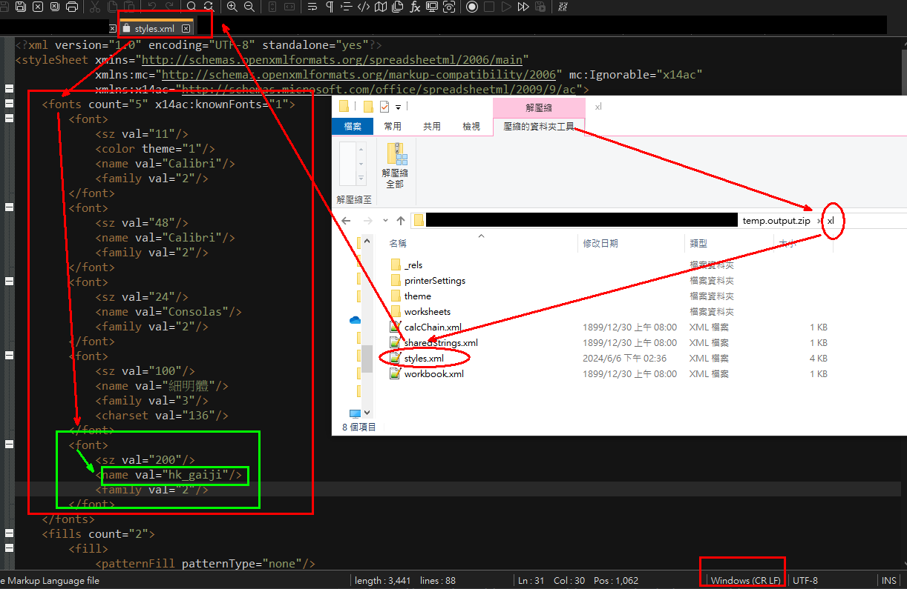

---
{
  "title": "excel",
  "tags": [ "excel", "office" ],
  "layout": "blog/blog.base.gohtml",
  "cTime": "2024-06-07T00:00:00+08:00",
  "mTime": "2023-06-07T00:00:00+08:00"
}
---

# excel

## FAQ

### 字型檔選不到

可能是字型檔中有些必要的碼位沒有提供，就會導致選擇的時候沒辦法選到該字型

如果你的字型確實可以安裝在電腦之中，那麼有一種方法可以解決此問題

將你的xlsx重新命名成zip，修改裡面的`xi/styles.xml`

```xml
<fonts count="3" x14ac:knownFonts="1">
  <!-- <font></font> 你也可以直接新增在第一套，這樣預設沒有指定字型的儲存格就會使用此套字 -->
  <font>
    <sz val="11"/>
    <color theme="1"/>
    <name val="Calibri"/>
    <family val="2"/>
  </font>
  <font>
    <sz val="24"/>
    <name val="Arial"/>
    <family val="2"/>
  </font>
  <font>
    <sz val="9"/>  <!-- 字體大小 -->
    <name val=""/> <!-- FontFamilyName nameID: 1-->
    <family val="3"/>
    <charset val="136"/>
  </font>
</fonts>
```

當你修改且保存完畢之後，再把它變回xlsx

此時字型的下拉式選單可能還是選不到該字型，但如果你直接把字型的family名稱填入，仍可以對儲存格造成影響




## 參考資料

- [file format: xlsx](https://docs.fileformat.com/spreadsheet/xlsx/)
- https://learn.microsoft.com/en-us/openspecs/office_standards/ms-xlsx/2c5dee00-eff2-4b22-92b6-0738acd4475e
  - [2013](https://msopenspecs.azureedge.net/files/MS-XLSX/%5bMS-XLSX%5d-131118.pdf)
