---
{
  "title": "linux",
  "tags": [ "os", "linux", "install", "ubuntu"],
  "layout": "blog/blog.base.gohtml",
  "cTime": "2024-11-05T19:00:00+08:00",
  "mTime": "2024-11-05T19:00:00+08:00"
}
---

# linux ubuntu作業系統安裝教學

- Linux 核心：這是一個開放原始碼的核心，由 Linus Torvalds 等開發者共同維護。核心負責處理底層的硬體資源管理，例如記憶體、處理器、網路等。
- Linux 發行版：以 Linux 核心為基礎，許多開發團隊會加入額外的軟體工具、桌面環境、應用程式和安裝管理系統，並形成所謂的「發行版」。例如 Ubuntu 就是一個流行的 Linux 發行版之一
- Ubuntu：Ubuntu 是由 Canonical 公司開發和維護的發行版，以 Debian 為基礎，並使用 Linux 核心。Ubuntu 因為其易於安裝、使用方便和社群支持度高，因此在個人電腦、伺服器以及雲端環境中很受歡迎。

---

訪問

> https://ubuntu.com/download/desktop#how-to-install-NobleNumbat

下載[Download 24.04.1 TLS](https://ubuntu.com/download/desktop/thank-you?version=24.04.1&architecture=amd64&lts=true)

流程

1. Download the ISO image: 這個內容就是上面的`Download 24.04.1 TLS`，下載完之後，會得到一個iso檔案，例如: `ubuntu-24.04.1-desktop-amd64.iso`
2. Create a bootable USB flash drive with [balenaEtcher](https://etcher.balena.io/#download-etcher) or similar (Rufus): 選擇你當前的作業系統去安裝`Etcher`，他是一個能將iso寫入到硬碟的軟體
3. Boot your laptop or PC from the USB flash drive

## [Rufus](https://rufus.ie/zh_TW/)

> 在Ubuntu.com其實也是有保留Rufus的教學版本，有興趣可以參考
>
> https://ubuntu.com/tutorials/create-a-usb-stick-on-windows#3-usb-selection

下載Rufus，可以下載免安裝或者安裝的版本，任一個都可以

- rufus-4.6.exe https://github.com/pbatard/rufus/releases/download/v4.6/rufus-4.6.exe
- rufus-4.6p.exe: https://github.com/pbatard/rufus/releases/download/v4.6/rufus-4.6p.exe

下載完之後，打開exe


將你的`ubuntu-24.04.1-desktop-amd64.iso`檔案放入

接著他會自己選擇相關設定

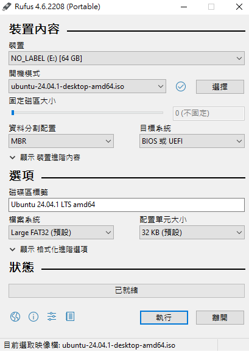

可以直接按下執行

使用建議設定即可

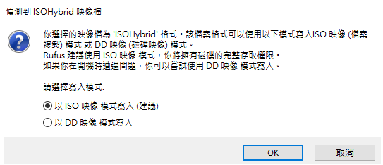

完成之後可以在`磁碟管理`(<kbd>Win+X</kbd>輸入) 中看到

UBUNTU 24_0 檔案系統FAT32

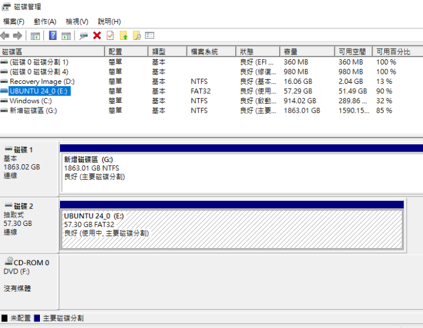

並且在檔案總管的該硬碟也確實可以被點進去查看到相關檔案

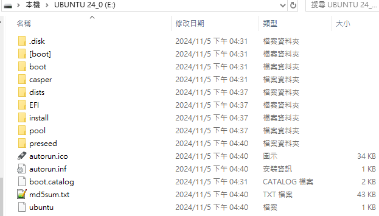

## ~~balenaEtcher~~ 不建議用，建議用Rufus

balenaEtcher 是一款免費的開源實用程序，用於將 .iso 和 .img 檔案等影像檔案以及壓縮資料夾寫入儲存媒體以建立即時 SD 卡和 USB 隨身碟

---

> 使用 balenaEtcher 可能會遇到USB read Only的問題，建議用Rufus

選擇你當前電腦對應的作業系統的版本，去下載

[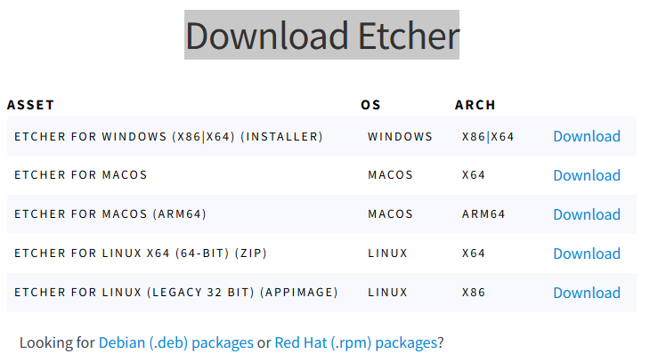](https://etcher.balena.io/#download-etcher)

完成之後選擇啟動你下載的檔案，例如: `balenaEtcher-1.19.25.Setup.exe`

> 記得請使用工作管理員啟動，否則選擇ISO檔案的時候可能會遇到錯誤: [Error(0,h.requestMetadata) is not a function](https://forums.balena.io/t/error-0-h-requestmetadata-is-not-a-function/371138/6)

選擇ISO檔案


選擇要寫入的USB

> 注意你的USB會被格式化！(所有usb的資料會被清除)

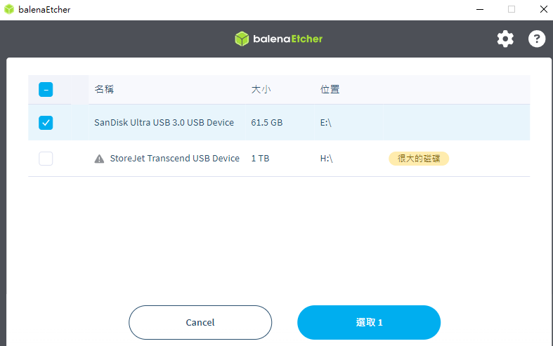

選好之後按下`現在燒錄！`

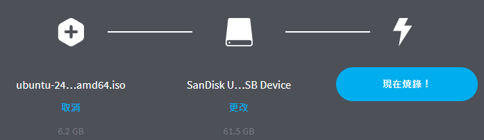

接著請等待燒錄完成

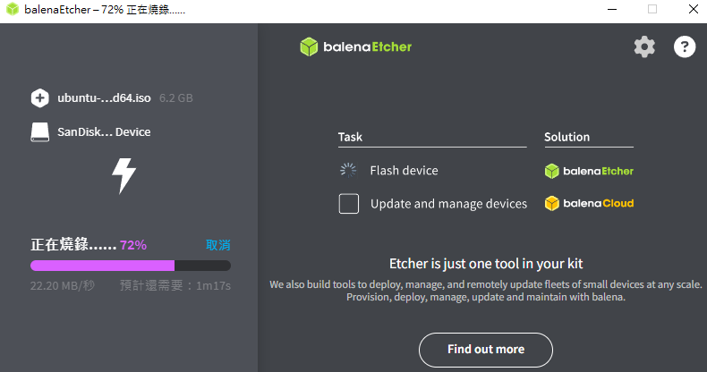

在你完成之後，他還會再驗證

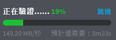


當你看到成功的訊息先別太高興

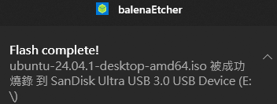

如果usb有問題，它會跳出需要格式化的選項

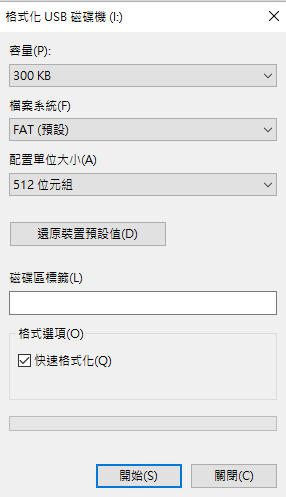

如果你遇到`磁碟有防寫保護`的訊息，可以參考[這篇](https://tw.easeus.com/partition-manager-tips/pen-drive-is-write-protected.html)的解法

```yaml
# 使用工作管理員於CMD輸入
diskpart
# 他會開啟一個新的窗口，在此窗口輸入
list disk
# 會顯示所有內容

# 磁碟 #    狀態           大小     可用     Dyn  Gpt
# --------  -------------  -------  -------  ---  ---
# 磁碟 0    連線              931 GB  5120 KB        *
# 磁碟 1    連線             1863 GB      0 B
# 磁碟 2    連線               57 GB    51 GB        *
# 磁碟 3    連線              931 GB      0 B

# 使用select disk，後面加上磁碟號碼來選取磁碟，假設我要處理的是57GB的硬碟，我要選2
select disk 2

# 清除唯讀屬性 (可選)
# attributes disk clear readonly

# 清理
clean
# DiskPart 成功地清理了磁碟

create partition primary
# 成功地建立了指定的磁碟分割

active
list partition
format override quick
```

完成之後再對此USB，進行格式化，應該就不會再被`磁碟有防寫保護`的訊息所檔

## 如何確認燒錄是否成功

使用磁碟工具檢查檔案系統

在 Windows 上，您可以使用「磁碟管理」檢查 USB 隨身碟的狀態：

按下 `Win + X`，選擇「磁碟管理」

找到 USB 隨身碟，檢查其分割區是否顯示為「RAW」格式或「未知」格式。如果是，表示 USB 格式異常或燒錄失敗


## 從usb安裝linux

在你使用Rufus將iso檔案寫入到usb之後

在開機選項之中選擇USB啟動即可

在開機的時候先進入BIOS (可以嘗試案下F1, F2, F10, F11, F12等等)

通常的Startup Menu的設計，會有以下內容 (但也非絕對如此，還是要看CPU)

```
System Information (F1)
System Diagnostics (F2)
Boot Menu (F9)
BIOS Setup (F10)
System Restore (F11)
Newwork (PXE) Boot (F12)
Select Language
View BIOS Event Log
Update System BIOS
```

要選擇的是Boot Menu，所以要按下F9

接著選擇剛才燒入的USB名稱

如果你沒有看到USB名稱，可能有一個選項是`Boot from file`

選擇這個之後會看到類似

```
UBUNTU 24_0, SanDisk Ultra USB 3.0 0101abcde....
```

進入之後找到`\EFI\boot`目錄

可能會看到

```
bootx64.efi: 這通常是標準的開機檔案，用於啟動 EFI 系統。大部分情況下，這是你要選的檔案。它通常會自動載入並啟動 Grub 或其他啟動管理器。
grubx64.efi: 這是 Grub 引導程式的 EFI 版本。Grub 是一個常見的 Linux 引導管理器。如果選擇這個，它會直接啟動 Grub，並讓你進入 Linux 安裝程序。
mmx64.efi: 這是 “Machine Manager”（通常是用於安全啟動）的模組，只有在安全啟動設定啟動管理器的情況下才會使用。大多數情況下，這個檔案不會是你想要的選項。
```

選擇`bootx64.efi`

進入之後再選擇`try or install ubuntu`，就可以開始安裝了

> 可以考慮把USB插在電腦後方，而非前面的USB插孔[temp.html](temp.html)

---

之後的教學可以參考官方的文件，有圖有文字很詳細

> https://ubuntu.com/tutorials/install-ubuntu-desktop#4-boot-from-usb-flash-drive


## 相關連結


- [Install Ubuntu desktop](https://ubuntu.com/tutorials/install-ubuntu-desktop#3-create-a-bootable-usb-stick)
- https://github.com/balena-io/etcher/issues/3373
- https://blog.balena.io/did-etcher-break-my-usb-sd-card/
- https://ubuntu.com/blog/top-10-apps-for-a-fresh-linux-install-in-2021
