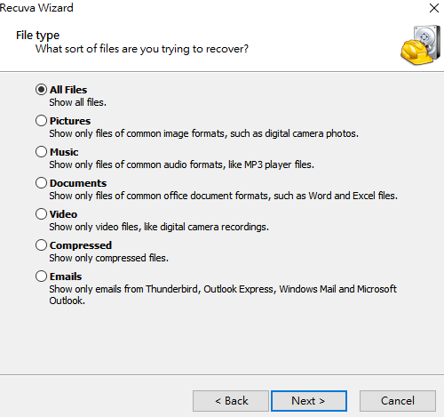
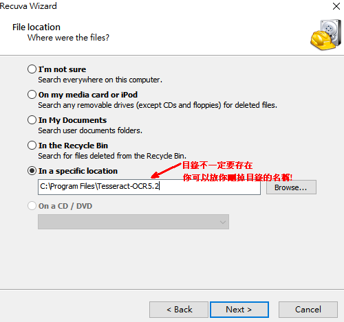

---
{
  "title": "restore",
  "tags": [ "os", "restore", "backup"],
  "layout": "blog/blog.base.gohtml",
  "cTime": "2023-03-16T15:48:00+08:00",
  "mTime": "2023-03-16T15:48:00+08:00"
}
---

# 資料誤刪還原

記得如果檔案或者資料夾誤刪，建議不要再繼續對硬碟做寫入的動作，會影響到後面還原成功率

工具推薦

- [Recuva](https://www.ccleaner.com/recuva/download): 這款除了可以列出誤刪的檔案以外，復原方式可以選擇恢復檔案或者連同資料夾結構也一起還原，而且有免費的方案
  > 預設是直接把檔案還原，資料夾結構不會還原，要還原資料夾有一個設定的選項，要自己找找

選擇要復原的檔案類型



假設你還記得原本被刪掉目錄的位置，那麼可以直接選取該位置即可



## 系統還原

可以透過以下指令來開啟系統還原

```
control.exe /name Microsoft.Recovery
```
